  <picture>
    <source
      media="(prefers-color-scheme: dark)"
      srcset="./assets/dark.svg">

    <source
      media="(prefers-color-scheme: light)"
      srcset="./assets/light.svg">

    
  </picture>

# Hi 👋, I'm Abhiram

### Full Stack Developer • Cybersecurity Enthusiast • Mobile App Developer

---

### 🚀 About Me

- 🔭 Currently learning **Full Stack Development & Cybersecurity**
- 🌱 Exploring **React, Node.js, TypeScript, Docker & Cloud**
- 💻 Passionate about building modern web applications
- 🤖 Interested in AI, Automation and Open Source
- 📫 Reach me at **abhiramvaitla7687@gmail.com**
- 🌐 Portfolio: **https://my-portfolio-two-livid-72.vercel.app**

---

##  Tech Stack

### Languages

### Frontend

### Backend

### Database

### DevOps & Tools

---

## 🚀 Featured Projects

<table>
<tr>

<td width="50%">

### 🩺 HealthCare Chatbot

AI-powered healthcare chatbot built using Neural Networks for symptom analysis and health assistance.

**Tech Stack**

Python • Machine Learning • FNN • Flask

[Repository](https://github.com/abhi7687/Helth_care_chatbot_using_FNN)

</td>

<td width="50%">

### 🌦 Smart Weather

Modern weather application with live weather, forecasts and responsive UI.

**Tech Stack**

React • Node.js • OpenWeather API

[Repository](https://github.com/abhi7687)

</td>

</tr>

<tr>

<td width="50%">

### 📋 Task Tracker CLI

A production-ready command line task manager published using Node.js.

**Tech Stack**

Node.js • JavaScript • CLI

[Repository](https://github.com/abhi7687/task-tracker-cli)

</td>

<td width="50%">

### 📊 Job Market Analytics

Interactive dashboard for analysing job trends using real-world datasets.

**Tech Stack**

Python • MySQL • Power BI

[Repository](https://github.com/abhi7687)

</td>

</tr>

</table>

---

## 📊 GitHub Analytics

---